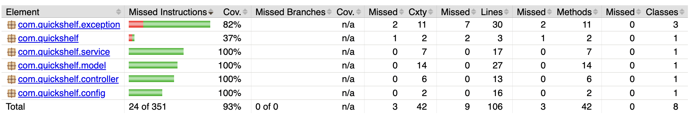
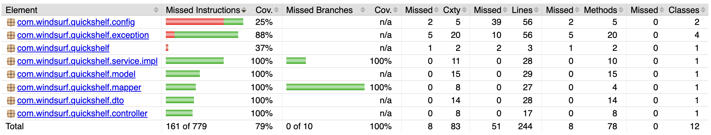

# POC - Agentic Coding Tools

**Welcome to the coworder, your new coder coworker!**

### Introductory Video

> [Watch the Introductory Video](https://drive.google.com/file/d/1YyltOnafY4TFqp9H94FDbs5PuMgtm9Rf/view?usp=sharing)

### Objective: 
Build a project from scratch using agentic coding tools with as minimal manual interventions (and prompts) as possible



### Considerations: 
- Prompt should be breakdown into requirements before implementation
- Each requirement (JIRA issue) should be implemented and tracked (statuses) along the progress.
- Implementation must contain tests (unit/integration)
- Project must offer configuration setup to run app/server in localhost
- Code and user guide documentation must be provided (e.g. Java Docs and README.md) 
- Changes shall be pushed and tracked in GitHub repository as well as project release to be published in GitHub


## Results

For each platform/tool, a separate repository will be created for future artifacts(output) comparison purposes

### Criteria:
- **Req Accuracy** : how accurate the generated artifacts(code, documentation, scripts) were to the actual prompt requirement
- **Hallucination** : unnecessary artifacts created, useless artifacts produced, and/or non requested changes/features added
- **Code Quality** : static code analysis tooling statistics (e.g. SonarQube) 
- **Test Coverage**: overall test coverage generated based on unit/integration tests created (e.g. Jacoco)

| Tool | Repository | Video | Req Accuracy | Hallucination | Code Quality | Test Coverage |
|-----------------|-----------------|-----------------|-----------------|-----------------|-----------------|-----------------|
| AWS Q  |  [quickshelf-awsq](https://github.com/vinipx/quickshelf-awsq) | [POC AWS Q](https://drive.google.com/file/d/1aik7bi-6z2mkCUN5JcUdyRhfxFFQ3Wgh/view?usp=sharing) | :star: :star: :star: :star: :star: | :star: :star: | ? | :star: :star: :star: :star: (93%) | 
| Windsurf  |  [quickshelf-windsurf](https://github.com/vinipx/quickshelf-windsurf) | [POC Windsurf](https://drive.google.com/file/d/1dbyHwMrl6W_fxgjrFNQI21XlPxjr61yZ/view?usp=sharing) | :star: :star: :star: | :star: | ? | :star: :star: :star: (79%) |
| Elitea    | [quickshelf-elitea](https://github.com/vinipx/quickshelf-elitea) | TODO | ? | ? | ? | ? |
| Gemini    | [quickshelf-gemini](https://github.com/vinipx/quickshelf-gemini) | TODO | ? | ? | ? | ? |

### Test Coverage

| Tool | Jacoco Report|
|-----------|-----------|
| AWS Q | |
| Windsurf |  |
| Elitea | -- |
| Gemini | -- |

## Prompts

### [One to rule them all](prompt.md) !  

> All projects shall start from the very same project context prompt.


## JIRA

For JIRA tracking, we will be using the [JIRA UTIL scripts](https://github.com/vinipx/jira-util) - to serve as utility to create/update JIRA tickets by the platform. 

